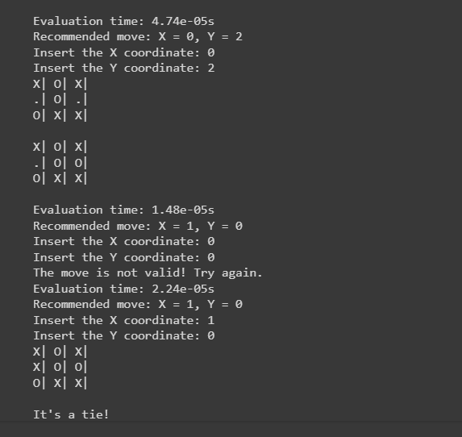

<h1>ExpNo 6 : Implement Alpha-beta pruning of Minimax Search Algorithm for a Simple TIC-TAC-TOE game</h1> 
<h3>Name: Saravanan N</h3>
<h3>Register Number/Staff Id: TSML006</h3>
<H3>Aim:</H3>

Implement Alpha-beta pruning of Minimax Search Algorithm for a Simple TIC-TAC-TOE game

<h1>GOALS of Alpha-Beta Pruning in MiniMax Search Algorithm</h1>

<h3>Improve the decision-making efficiency of the computer player by reducing the number of evaluated nodes in the game tree.</h3>
<h3>Tic-Tac-Toe game implementation incorporating the Alpha-Beta pruning and the Minimax algorithm with Python Code.</h3>
<h1>IMPLEMENTATION</h1>

The project involves developing a Tic-Tac-Toe game implementation incorporating the Alpha-Beta pruning with the Minimax algorithm. Using this algorithm, the computer player analyzes the game state, evaluates possible moves, and selects the optimal action based on the anticipated outcomes.

<h1>The Minimax algorithm</h1>

recursively evaluates all possible moves and their potential outcomes, creating a game tree.

<h1>Alpha-Beta pruning</h1>

Alpha–Beta (𝛼−𝛽) algorithm is actually an improved minimax using a heuristic. It stops evaluating a move when it makes sure that it’s worse than a previously examined move. Such moves need not to be evaluated further.

When added to a simple minimax algorithm, it gives the same output but cuts off certain branches that can’t possibly affect the final decision — dramatically improving the performance

<h2>Sample Input and Output:</h2>

<h3>Result:</h3>

Thus the program for implementation of Alpha-beta pruning of Minimax Search Algorithm for a Simple TIC-TAC-TOE game is successfully executed.

